# SDD — Software Design Document

## Document Header

| Doc ID | Scope | Owner | Status |
|---|---|---|---|
| SDD-<PROJECT-or-SUBSYSTEM-or-FEATURE-or-CAPABILITY> | Top-level \| Subsystem: `doc/subsystems/<SubsystemName>/` \| Feature: `doc/features/<FeatureName>/` \| Capability: `doc/capabilities/<CapabilityName>/` | <name/team> | Draft \| Active \| Deprecated |

| Last Updated | Related SRS | Related TCS | Notes |
|---|---|---|---|
| YYYY-MM-DD | SRS-… | TCS-… | <optional> |

## Design Summary

- **Primary intent**: <1–3 bullets>
- **Key constraints**: <bullets>
- **Non-goals**: <bullets>

## Diagrams (Mermaid)

Use Mermaid for high-signal structure/sequence diagrams.

Rule: every Mermaid block must include the theme snippet from `.github/instructions/mermaid.instructions.md`.

Rule: for every Mermaid diagram, add a short definitions/glossary section directly under the diagram and a brief narrative explaining the data flow (inputs/outputs, ordering, and failure/degraded behavior if relevant).

### Structure (example)

```mermaid
%%{init: {'theme': 'base', 'themeVariables': { 'fontSize': '14px', 'primaryColor': 'var(--mmd-surface-alt)', 'primaryTextColor': 'var(--mmd-text)', 'primaryBorderColor': 'var(--mmd-line)', 'secondaryColor': 'var(--mmd-surface)', 'secondaryTextColor': 'var(--mmd-text)', 'lineColor': 'var(--mmd-line)', 'tertiaryColor': 'var(--mmd-accent)', 'noteBkgColor': 'var(--mmd-surface-alt)', 'noteTextColor': 'var(--mmd-text)' }, 'themeCSS': '.mermaid{--mmd-surface:#f8fafc;--mmd-surface-alt:#e2e8f0;--mmd-line:#475569;--mmd-text:#0f172a;--mmd-accent:#0ea5e9;--mmd-warn:#f97316;--mmd-positive:#16a34a;background-color:var(--mmd-surface);color:var(--mmd-text);} @media (prefers-color-scheme: dark){.mermaid{--mmd-surface:#0f172a;--mmd-surface-alt:#1f2937;--mmd-line:#94a3b8;--mmd-text:#f8fafc;--mmd-accent:#38bdf8;--mmd-warn:#fb923c;--mmd-positive:#22c55e;background-color:var(--mmd-surface);color:var(--mmd-text);}} .mermaid svg{background-color:var(--mmd-surface);} .mermaid .node rect,.mermaid .actor,.mermaid .cluster rect{fill:var(--mmd-surface);stroke:var(--mmd-line);} .mermaid .node text,.mermaid .actor text,.mermaid text.actor,.mermaid .label text{fill:var(--mmd-text);} .mermaid .edgePath .path,.mermaid line,.mermaid path{stroke:var(--mmd-line);} .mermaid .note{fill:var(--mmd-surface-alt);stroke:var(--mmd-line);color:var(--mmd-text);}'}%%
graph TD
	A[<Component A>] --> B[<Component B>]
```

#### Diagram Definitions (example)

- **Component A**: <what it is; key input/output>
- **Component B**: <what it is; key input/output>

#### Data Flow Narrative (example)

- <1–4 bullets describing the flow and key assumptions>

### Sequence

Add sequence diagrams as needed; duplicate the Mermaid block and keep the same init/theme snippet at the top.

## Design Elements (optional but recommended)

Use `DES-####` when you want stable references independent of section numbering.

| DES-ID | Name | Responsibility | Realizes REQ-ID(s) | Code Ref(s) |
|---|---|---|---|---|
| DES-0001 | CaptureScheduler | Schedules capture/encode bursts. | REQ-0001 | <path/to/file.cs>#L123 or type name |
| DES-0002 | CaptureNaming | Produces deterministic capture file names. | REQ-0002 | <path/to/file.cs>#L456 or type name |

## Key Decisions

| Decision ID | Statement | Rationale | Status |
|---|---|---|---|
| DEC-0001 | Example: Use a background queue for encoding. | Avoid frame stalls on render thread. | Accepted |

## Checklist

- Every `DES-*` row lists at least one `REQ-*` in `Realizes REQ-ID(s)`.
- Add `Code Ref(s)` for non-trivial design elements.

## Change Log

| Date | Change | Author |
|---|---|---|
| YYYY-MM-DD | Initial draft | <name> |
