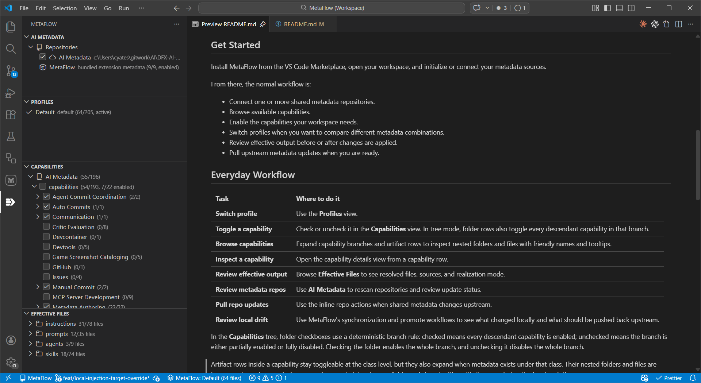

# MetaFlow

Solve AI metadata sprawl by composing and applying layered AI metadata for GitHub Copilot and other coding agents from shared repositories into your VS Code workspace, without ad-hoc copy and paste.

> [!IMPORTANT]
> MetaFlow is in `v0.x` preview. Expect workflow and command-surface adjustments as feedback is incorporated.

_MetaFlow brings shared AI metadata, capabilities, profiles, and effective output review into one VS Code workflow._

## Why MetaFlow

- Deploy shared AI metadata consistently across large teams and organizations.
- Package related metadata into reusable capabilities made up of instructions, prompts, skills, agents, and hooks.
- Experiment with different metadata combinations through profiles and selective capability activation.
- Resolve everything into one effective workspace view before anything is written.
- Protect local edits with drift-aware synchronization and provenance tracking.

## What MetaFlow Enables

- Standardize AI coding guidance across many repositories without copying metadata by hand.
- Browse and activate reusable capabilities instead of managing loose files.
- Switch between different metadata setups with a few clicks using profiles.
- Roll out shared metadata updates deliberately by seeing when upstream repositories changed and deciding when to pull them.
- Materialize effective metadata into local `.github` folders when file-based consumption or checked-in snapshots are useful.
- Keep file-based metadata local-only with `.gitignore` when it should not be committed.
- Review synchronized changes as normal file diffs and promote useful local improvements back to shared metadata sources.
- Choose which metadata types are delivered through VS Code settings versus synchronized files.
- Choose whether settings-backed metadata lands at the user, workspace, or workspace-folder scope.

## The MetaFlow sidebar

MetaFlow adds four views to the Activity Bar:

| View                | What it helps you do                                                                                                                                      |
| ------------------- | --------------------------------------------------------------------------------------------------------------------------------------------------------- |
| **AI Metadata**     | Review metadata sources, warnings, rescans, and repository update actions.                                                                                |
| **Profiles**        | Switch the active profile for the current workspace.                                                                                                      |
| **Capabilities**    | Enable or disable capabilities, toggle whole folder branches in tree mode, browse underlying artifact directories and files, and open capability details. |
| **Effective Files** | Inspect the resolved files, where they came from, and whether they are settings-backed or synchronized.                                                   |

## Get Started

Install MetaFlow from the VS Code Marketplace, open your workspace, and initialize or connect your metadata sources.

From there, the normal workflow is:

- Connect one or more shared metadata repositories.
- Browse available capabilities.
- Enable the capabilities your workspace needs.
- Switch profiles when you want to compare different metadata combinations.
- Review effective output before or after changes are applied.
- Pull upstream metadata updates when you are ready.

## Everyday Workflow

| Task                        | Where to do it                                                                                                                      |
| --------------------------- | ----------------------------------------------------------------------------------------------------------------------------------- |
| **Switch profile**          | Use the **Profiles** view.                                                                                                          |
| **Toggle a capability**     | Check or uncheck it in the **Capabilities** view. In tree mode, folder rows also toggle every descendant capability in that branch. |
| **Browse capabilities**     | Expand capability branches and artifact rows to inspect nested folders and files with friendly names and tooltips.                  |
| **Inspect a capability**    | Open the capability details view from a capability row.                                                                             |
| **Review effective output** | Browse **Effective Files** to see resolved files, sources, and realization mode.                                                    |
| **Review metadata repos**   | Use **AI Metadata** to rescan repositories and review update status.                                                                |
| **Pull repo updates**       | Use the inline repo actions when shared metadata changes upstream.                                                                  |
| **Review local drift**      | Use MetaFlow's synchronization and promote workflows to see what changed locally and what should be pushed back upstream.           |

Tree layout preferences are local workspace state, not VS Code settings. MetaFlow persists the Capabilities layout and Effective Files layout in `.metaflow/state.json`, defaulting to hierarchical Capabilities and flat Effective Files.

In the **Capabilities** tree, folder checkboxes use a deterministic branch rule: checked means every descendant capability is enabled; unchecked means the branch is either partially enabled or fully disabled. Checking the folder enables the whole branch, and unchecking it disables the whole branch.

Artifact rows inside a capability stay toggleable at the class level, but they also expand when metadata exists under that class. Their nested folders and files are browse-only, prefer user-facing names from metadata when available, and show tooltips with the canonical path plus description.

## Shared Metadata Workflows

- **Centralize metadata at scale**: keep instructions, prompts, agents, skills, and hooks in shared repositories and deploy them consistently across many workspaces.
- **Experiment safely**: use profiles and selective capability activation to compare different metadata combinations without rebuilding your setup by hand.
- **Check in the effective state when needed**: synchronize metadata into the local `.github` folder when you want a reviewable, reproducible snapshot in the repository.
- **Keep local-only materialization out of git**: use `.gitignore` when file-based metadata is required locally but should not be committed.
- **Promote improvements upstream**: when a synchronized local copy is improved, treat it as a candidate to reverse-sync back into the shared metadata repository for broader reuse.
- **Mix delivery models by type**: keep some artifact types settings-backed while materializing others as files.
- **Choose the right scope for settings injection**: deliver settings-backed metadata at the user, workspace, or workspace-folder level depending on how your team operates.

## Built-in MetaFlow Capability

MetaFlow includes a bundled starter capability so you can try the workflow before setting up a larger shared metadata repository.

- Use it to understand the capability model quickly.
- Synchronize it locally when you want editable files.
- Externalize the patterns that work into a shared team or organization metadata repository.

## Where to go next

| Topic                                                                         | Document                                         |
| ----------------------------------------------------------------------------- | ------------------------------------------------ |
| Full extension reference: config schema, command surface, settings, manifests | [src/README.md](src/README.md)                   |
| CLI commands, automated promotion, validation, watch workflows                | [packages/cli/README.md](packages/cli/README.md) |
| Troubleshooting and support                                                   | [SUPPORT.md](SUPPORT.md)                         |
| Contributor workflow, testing, release readiness                              | [AGENTS.md](AGENTS.md)                           |
| Release process                                                               | [RELEASING.md](RELEASING.md)                     |

## Support

- Usage help and issue routing: [SUPPORT.md](SUPPORT.md)
- Bug reports and feature requests: [GitHub Issues](https://github.com/dynfxdigital/MetaFlow/issues)
- Security reporting: [.github/SECURITY.md](.github/SECURITY.md)

## License

MIT
