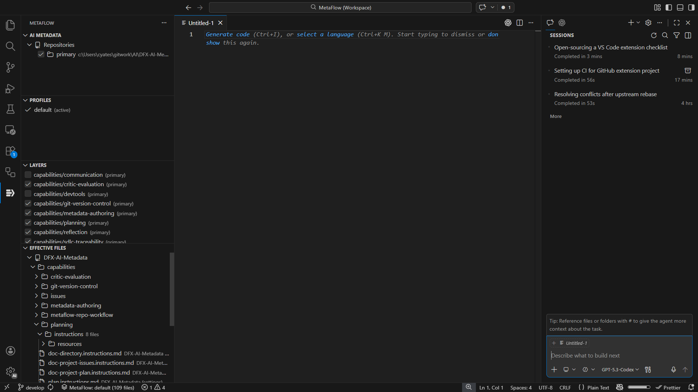

# MetaFlow

[](https://github.com/dynfxdigital/MetaFlow/actions/workflows/ci.yml?query=branch%3Amain)
[](https://github.com/dynfxdigital/MetaFlow/releases)
[](https://github.com/dynfxdigital/MetaFlow/actions/workflows/release.yml)

MetaFlow provides deterministic AI metadata overlays for Copilot instructions, prompts, skills, and agents.

MetaFlow gives you one consistent way to compose and apply layered AI metadata (instructions, prompts, skills, agents) without ad-hoc copy/paste.

> [!IMPORTANT]
> MetaFlow is in `v0.x` preview. Expect workflow and command-surface adjustments as open-source feedback is incorporated.

## Release Notes

- Repository changelog: [CHANGELOG.md](CHANGELOG.md)
- Extension changelog: [src/CHANGELOG.md](src/CHANGELOG.md)

## Screenshot



MetaFlow Activity Bar view showing AI Metadata, Profiles, Layers, and Effective Files panels.

## Why teams use MetaFlow

- **Deterministic output**: same config + same metadata input = same result.
- **Safe updates**: drift detection helps avoid overwriting local edits.
- **Auditability**: materialized files include provenance headers.
- **Editor + automation parity**: VS Code and CLI share the same engine behavior.

## What it manages

- Instructions and prompts
- Skills and custom agents
- Layered policy/profile composition
- Settings-backed and materialized artifact routing

## Quick start

### 1) Install

Install a release VSIX from the [Releases](https://github.com/dynfxdigital/MetaFlow/releases) page.

```bash
code --install-extension <metaflow-release>.vsix
```

### 2) Initialize config

In VS Code, run:

- `MetaFlow: Initialize Configuration`

Then edit `.metaflow/config.jsonc` and set at least:

- `metadataRepo.localPath`
- `layers`
- `activeProfile` (optional; defaults can be used)

### 3) Use automatic mode (default)

Automatic mode is the recommended workflow and is enabled by default (`metaflow.autoApply: true`).

After saving config changes, MetaFlow automatically refreshes and applies overlay results.

In normal use, you do not need to run apply commands manually.

### 4) Optional manual controls

Run:

- `MetaFlow: Preview`
- `MetaFlow: Apply`

Use manual commands when you want explicit control (for example, checking pending changes before writing).

## Typical workflow

1. Adjust layers/profiles in `.metaflow/config.jsonc`.
2. Save config; MetaFlow auto-refreshes and auto-applies.
3. Check status/output if you need to verify results.
4. Use preview/apply only when you want explicit manual control.
5. Use promote/drift workflows when local edits should move upstream.

`.metaflow/config.jsonc` can be either checked in (team-shared behavior) or kept local/untracked (user-isolated behavior). Runtime state stays in `.metaflow/state.json` and is typically ignored.

## Runtime discovery for changing source repos

When metadata source repositories add/remove layer directories over time, MetaFlow can adapt at runtime:

- Configure discovery per multi-repo source with `metadataRepos[].discover.enabled: true`
- Discovery is tied to automatic mode (`metaflow.autoApply: true`)
- With auto mode enabled, refresh resolves explicit + discovered layers
- With auto mode disabled, regular refresh resolves explicit layers only
- Use the inline refresh icon on a repository row in the Config view to force an on-demand rescan

Optional excludes:

```jsonc
{
	"metadataRepos": [
		{
			"id": "company",
			"localPath": "../DFX-AI-Metadata",
			"discover": {
				"enabled": true,
				"exclude": ["archive", "archive/**", "**/deprecated/**"]
			}
		}
	]
}
```

## Capability manifests (optional)

MetaFlow now supports optional capability manifests at layer roots using `CAPABILITY.md`.

Use minimal YAML frontmatter:

```md
---
name: SDLC Traceability
description: Shared SDLC traceability metadata.
license: MIT
---
```

Rules:

- Required fields: `name`, `description`
- Optional field: `license` (SPDX identifier/expression or `SEE-LICENSE-IN-REPO`)
- Internal capability identity is derived from the layer directory name
- Unknown fields are allowed but produce warnings

When present, capability metadata is surfaced in CLI `status` and in VS Code Layer/File tooltips.

## Command overview

Core VS Code commands (manual controls and diagnostics):

- `MetaFlow: Refresh`
- `MetaFlow: Preview`
- `MetaFlow: Apply`
- `MetaFlow: Clean`
- `MetaFlow: Status`
- `MetaFlow: Switch Profile`
- `MetaFlow: Toggle Layer`
- `MetaFlow: Check Repository Updates`
- `MetaFlow: Pull Repository Updates`
- `MetaFlow: Initialize MetaFlow AI Metadata`
- `MetaFlow: Open Config`
- `MetaFlow: Initialize Configuration`
- `MetaFlow: Promote`

For full command and setting details, see [src/README.md](src/README.md).

## Troubleshooting

- Use `MetaFlow: Status` and the MetaFlow output channel first.
- Validate your metadata repo path and layer names in `.metaflow/config.jsonc`.
- In automatic mode, save config and inspect output; use `Preview`/`Apply` only for explicit control.
- If files are skipped, check drift output and decide whether to promote or force overwrite via CLI.

## Known Issues / Limitations

- Preview-phase surface area: command names and behavior may continue to evolve during `v0.x`.
- Capability metadata tooltips update after refresh; edits in linked metadata repos are not watched continuously.
- Automatic discovered-layer resolution is tied to automatic mode (`metaflow.autoApply: true`).
- Validation coverage is strongest on desktop VS Code extension workflows; remote/container scenarios may need additional hardening.

## Roadmap

- Improve first-run onboarding with clearer starter metadata templates and usage examples.
- Expand integration and release rehearsal coverage for open-source launch confidence.
- Harden repository update ergonomics and background status visibility.
- Continue tightening documentation traceability across requirements, design, and tests.

## Support

- Usage help and troubleshooting: [SUPPORT.md](SUPPORT.md)
- Bug reports and feature requests: [GitHub Issues](https://github.com/dynfxdigital/MetaFlow/issues)
- Security reporting: [.github/SECURITY.md](.github/SECURITY.md)

## For contributors and maintainers

Developer and project operations docs are intentionally separated from this user-focused README:

- Contributing guide: [.github/CONTRIBUTING.md](.github/CONTRIBUTING.md)
- Architecture and contributor workflow: [AGENTS.md](AGENTS.md)
- Release process: [RELEASING.md](RELEASING.md)
- CLI deep usage: [packages/cli/README.md](packages/cli/README.md)
- Formal requirements/design/test docs: [doc/](doc/)

## License

MIT
