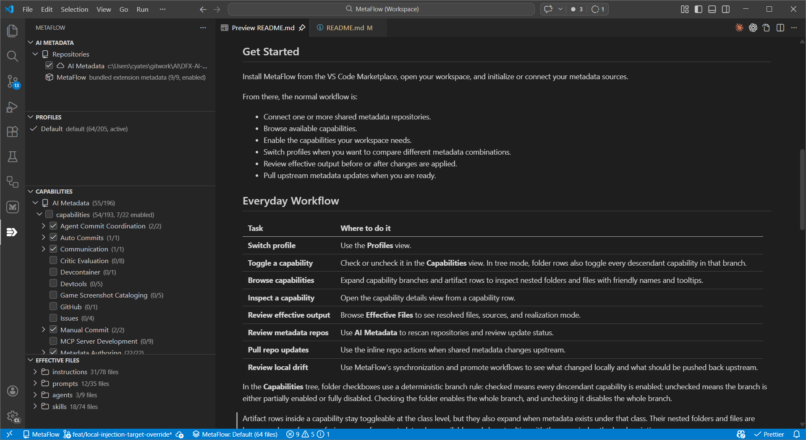

# MetaFlow

Solve AI metadata sprawl by composing and applying layered AI metadata for GitHub Copilot and other coding agents from shared repositories into your VS Code workspace, without ad-hoc copy and paste.

> [!IMPORTANT]
> MetaFlow is in `v0.x` preview. Expect workflow and command-surface adjustments as feedback is incorporated.



_MetaFlow brings shared AI metadata, capabilities, profiles, and effective output review into one VS Code workflow._

## Why MetaFlow

- Deploy shared AI metadata consistently across large teams and organizations.
- Package related metadata into reusable capabilities made up of instructions, prompts, skills, agents, and hooks.
- Experiment with different metadata combinations through profiles and selective capability activation.
- Resolve everything into one effective workspace view before anything is written.
- Protect local edits with drift-aware synchronization and provenance tracking.

## What MetaFlow Enables

- Standardize AI coding guidance across many repositories without copying metadata by hand.
- Browse and activate reusable capabilities instead of managing loose files.
- Switch between different metadata setups with a few clicks using profiles.
- Roll out shared metadata updates deliberately by seeing when upstream repositories changed and deciding when to pull them.
- Materialize effective metadata into local `.github` folders when file-based consumption or checked-in snapshots are useful.
- Keep file-based metadata local-only with `.gitignore` when it should not be committed.
- Review synchronized changes as normal file diffs and promote useful local improvements back to shared metadata sources.
- Choose which metadata types are delivered through VS Code settings versus synchronized files.
- Choose whether settings-backed metadata lands at the user, workspace, or workspace-folder scope.

## The MetaFlow sidebar

MetaFlow adds four views to the Activity Bar:

| View                | What it helps you do                                                                                                                                      |
| ------------------- | --------------------------------------------------------------------------------------------------------------------------------------------------------- |
| **AI Metadata**     | Review metadata sources, warnings, rescans, and repository update actions.                                                                                |
| **Profiles**        | Switch the active profile for the current workspace.                                                                                                      |
| **Capabilities**    | Enable or disable whole capabilities, toggle whole folder branches in tree mode, browse underlying artifact directories and files, and open capability details. |
| **Effective Files** | Inspect the resolved files, where they came from, and whether they are settings-backed or synchronized.                                                   |

## Get Started

Install MetaFlow from the VS Code Marketplace, open your workspace, and initialize or connect your metadata sources.

From there, the normal workflow is:

- Connect one or more shared metadata repositories.
- Browse available capabilities.
- Enable the capabilities your workspace needs.
- Switch profiles when you want to compare different metadata combinations.
- Review effective output before or after changes are applied.
- Pull upstream metadata updates when you are ready.

## Everyday Workflow

| Task                        | Where to do it                                                                                                                      |
| --------------------------- | ----------------------------------------------------------------------------------------------------------------------------------- |
| **Switch profile**          | Use the **Profiles** view.                                                                                                          |
| **Toggle a capability**     | Check or uncheck it in the **Capabilities** view. In tree mode, folder rows also toggle every descendant capability in that branch. Capabilities are atomic: artifact folders inside a capability are browse-only, not partial enablement switches. |
| **Browse capabilities**     | Expand capability branches and artifact rows to inspect nested folders and files with friendly names and tooltips.                  |
| **Inspect a capability**    | Open the capability details view from a capability row.                                                                             |
| **Review effective output** | Browse **Effective Files** to see resolved files, sources, and realization mode.                                                    |
| **Review metadata repos**   | Use **AI Metadata** to rescan repositories and review update status.                                                                |
| **Pull repo updates**       | Use the inline repo actions when shared metadata changes upstream.                                                                  |
| **Review local drift**      | Use MetaFlow's synchronization and promote workflows to see what changed locally and what should be pushed back upstream.           |

Tree layout preferences are local workspace state, not VS Code settings. MetaFlow persists the Capabilities layout and Effective Files layout in `.metaflow/state.json`, defaulting to hierarchical Capabilities and flat Effective Files.

In the **Capabilities** tree, folder checkboxes use a deterministic branch rule: checked means every descendant capability is enabled; unchecked means the branch is either partially enabled or fully disabled. Checking the folder enables the whole branch, and unchecking it disables the whole branch.

Artifact rows inside a capability expand when metadata exists under that class. The rows and their nested folders/files are browse-only, prefer user-facing names from metadata when available, and show tooltips with the canonical path plus description.

## Shared Metadata Workflows

- **Centralize metadata at scale**: keep instructions, prompts, agents, skills, and hooks in shared repositories and deploy them consistently across many workspaces.
- **Experiment safely**: use profiles and selective capability activation to compare different metadata combinations without rebuilding your setup by hand.
- **Check in the effective state when needed**: synchronize metadata into the local `.github` folder when you want a reviewable, reproducible snapshot in the repository.
- **Keep local-only materialization out of git**: use `.gitignore` when file-based metadata is required locally but should not be committed.
- **Promote improvements upstream**: when a synchronized local copy is improved, treat it as a candidate to reverse-sync back into the shared metadata repository for broader reuse.
- **Mix delivery models by type**: keep some artifact types settings-backed while materializing others as files.
- **Activate plugin-capable capabilities locally**: route supported artifact types through local Copilot plugin discovery instead of only alternate-path settings or `.github` synchronization.
- **Choose the right scope for settings injection**: deliver settings-backed metadata at the user, workspace, or workspace-folder level depending on how your team operates.

## Built-in MetaFlow Capability

MetaFlow includes a bundled starter capability so you can try the workflow before setting up a larger shared metadata repository.

- Use it to understand the capability model quickly.
- Use the bundled metadata-authoring guidance when you need to create or refine instructions, prompts, agents, skills, hooks, or capability manifests from the current context.
- Synchronize it locally when you want editable files.
- Bundled authoring instructions stay narrowly scoped; the built-in set does not rely on exact `applyTo: "**"` injections.
- Externalize the patterns that work into a shared team or organization metadata repository.

## Codex Support

MetaFlow treats Codex as a host-native target, not as a GitHub Copilot plugin alias.

- Codex repository skills are authored under `.agents/skills/**` in a capability and synchronize to the same root-relative `.agents/skills/**` path in the consuming workspace.
- Canonical MetaFlow skills can be authored under `.metaflow/skills/<skill-id>/SKILL.md` with optional `.metaflow/skills/<skill-id>/skill.json` metadata for stable identity, routing tags, risk posture, targets, and description. MetaFlow projects `SKILL.md` to both `skills/<skill-id>/SKILL.md` for Copilot plugin packaging and `.agents/skills/<skill-id>/SKILL.md` for Codex repository skills while retaining the canonical source path in managed state.
- Codex skill files remain synchronized metadata even when the workspace uses plugin mode for Copilot `skills/**` artifacts.
- Canonical MetaFlow instruction and prompt files can be authored under `.metaflow/instructions/*.md` and `.metaflow/prompts/*.md` with optional same-name `.json` metadata for stable identity, routing tags, risk posture, targets, and description. MetaFlow projects the Markdown bodies to `instructions/*.md` and `prompts/*.md` with canonical source provenance and target projection metadata for hosts that consume those files.
- Codex custom prompts are deprecated local-only slash-command files under the user's Codex home directory. MetaFlow keeps canonical prompts as reviewable metadata for Codex, but shared Codex workflows should use `.metaflow/skills/**` projected to `.agents/skills/**`.
- Existing unmanaged `.agents/skills/**` destinations are protected from accidental overwrite, and managed Codex skill files use the same drift-aware apply and clean behavior as other synchronized files.
- `AGENTS.md` and `AGENTS.override.md` are synchronized to the consuming repository root as Codex project instructions with unmanaged-destination and drift protection.
- `.codex/**` project configuration and policy files synchronize root-relative with managed-state-only provenance; existing unmanaged `.codex/**` destinations block apply before overwrite.
- `.worktreeinclude` synchronizes root-relative with managed-state-only provenance. MetaFlow guards and reports the file as the `worktreeInclude` target-adapter concept, but Codex app managed-worktree creation and ignored-file copy behavior remain Codex runtime behavior.
- Codex plugins use `.codex-plugin/plugin.json`; GitHub Copilot agent plugins use capability-root `plugin.json`.
- Codex plugin marketplaces use `.agents/plugins/marketplace.json`; GitHub Copilot marketplace generation uses `.github/plugin/marketplace.json`.
- Canonical `.metaflow/policies/*.json`, `.metaflow/mcp/*.json`, `.metaflow/hooks/*.json`, `.metaflow/execution/*.json`, `.metaflow/memory/*.json`, `.metaflow/evaluation/*.json`, `.metaflow/runtime-evidence/*.json`, `.metaflow/packages/*.json`, and `.metaflow/tools/*.json` manifests load as capability metadata and appear in CLI preview text and JSON with source provenance, diagnostics, target posture, and policy grant references.
- Canonical evaluation profiles can distinguish static projection checks from harness-native runtime evaluations with `evidenceKind`, tested harness, adapter version, scenario, validation command, evidence references, and known limitations.
- Canonical runtime evidence records attach target-level harness proof, partial proof, failed runs, `not-run` records, or waivers to target capability concepts such as `issuePrOperation`, `reviewRuntime`, `cloudEnvironmentRuntime`, and `permissionRuntime`. MetaFlow uses `.metaflow/runtime-evidence/*.json` records to make runtime-only support claims reviewable without treating repository metadata as the runtime authority. Optional `validatedAt` and `expiresAt` timestamps make evidence freshness explicit. Local structured artifact refs for reports, logs, screenshots, traces, recordings, and files are checked relative to the metadata layer so stale proof paths and escaped local paths surface as diagnostics; optional `sha256` digests detect changed local artifacts. Runtime evidence adapter-version mismatches also surface as diagnostics so retained proof remains visible without appearing current by default.
- Canonical package manifests may include `marketplaceEntries` records for target catalog display intent, including target, package name, title, summary, publisher, categories, keywords, and URL. These records describe marketplace intent; host-specific marketplace files remain generated or maintained through their own adapter surfaces.
- Canonical package manifests may include `runtimeValidation` records for target package claims. Each record identifies the target harness, tested surface, adapter version, scenario, status, validation command, target capability concepts, evidence references, structured evidence artifacts, and known limitations so static package metadata is distinct from harness-native runtime proof. Records that omit both a validation command and evidence references remain review warnings because the runtime claim is not reproducible from the package metadata, and positive runtime-only concept claims warn when they do not include structured evidence artifacts for package review.
- Canonical execution profiles can classify Codex programmatic execution surfaces such as GitHub Action runs, app-server integrations, and SDK-embedded agents. These classifications document intended runtime shape and policy needs; they do not create workflow files, start app-server transports, initialize JSON-RPC clients, install SDK packages, invoke SDK code, initialize embedding applications, or grant CI/runtime authority.
- Codex Cloud environments and GitHub-hosted agent environments are runtime-only. MetaFlow can record intended execution posture and validation evidence, but repository metadata does not select hosted environments, configure secrets, run setup scripts, choose internet-access policy, install dependencies, or prove hosted task behavior.
- Codex subagent workflows and GitHub Copilot or Agent HQ custom-agent routing are runtime-only. MetaFlow can project and review custom-agent metadata, but repository metadata does not spawn agents, manage active agent threads, satisfy runtime approvals, route hosted work, or prove custom-agent execution.
- Codex automations and scheduled or recurring host-agent workflows are runtime-only. MetaFlow can record automation intent, reusable skills, policy grants, and evidence requirements, but repository metadata does not create schedules, keep the Codex app or host runtime available, select local versus worktree execution, manage Triage or archive state, or prove background execution.
- Codex, GitHub Copilot, and Agent HQ authentication is runtime-only. MetaFlow can record authentication intent, credential-storage expectations, policy grants, and evidence requirements, but repository metadata does not sign in users, create or store API keys or access tokens, connect workspace or GitHub accounts, satisfy SSO or admin policy, grant entitlements, or prove authenticated runtime behavior.
- Codex, GitHub Copilot, and Agent HQ permissions are runtime-only. MetaFlow can record desired permission posture, policy grants, command rules, and evidence requirements, but repository metadata does not grant runtime permissions, approve boundary-crossing actions, select effective managed requirements, enforce sandboxing, run auto-review decisions, satisfy organization policy, or prove permission behavior.
- Codex, GitHub Copilot, and Agent HQ enterprise policy is runtime-only. MetaFlow can record governance posture, policy grants, and evidence requirements, but repository metadata does not assign administrator roles, apply cloud-managed requirements, write device-level policy, select effective governance layers, change organization policy, approve marketplace sources, enforce feature pins, or prove policy behavior.
- Codex, GitHub Copilot, and Agent HQ review behavior is runtime-only. MetaFlow can record review guidance and evidence requirements, but repository metadata does not open review panes, run `/review`, enable code review settings, trigger `@codex review`, post GitHub reviews, read pull request feedback, assign hosted reviewers, satisfy organization policy, or prove review-feedback handling.
- Codex, GitHub Copilot, and Agent HQ app connectors are runtime-only. MetaFlow can record connector intent and evidence requirements, but repository metadata does not install Slack or Linear apps, approve workspace or organization connectors, connect GitHub accounts, link users, add apps to channels, configure posting policy, or prove connector task behavior.
- Codex and GitHub Copilot plugin manifests and marketplace catalogs are repository metadata. Plugin installation, enablement, workspace sharing, app authentication, MCP setup, restart discovery, and task-time invocation remain runtime-only evidence responsibilities.
- Canonical memory scope metadata records intended memory boundaries, retention, sharing, and policy posture. Codex Memories are opt-in runtime state under the Codex home directory and are controlled by Codex settings and per-thread controls; repository metadata does not enable Memories, generate memory files, authorize thread memory use, or prove recall behavior.
- Codex Chronicle is runtime-only. MetaFlow can record Chronicle intent and evidence requirements, but repository metadata does not enable Memories, turn on Chronicle, grant macOS Screen Recording or Accessibility permissions, capture screen context, process screenshot frames or OCR text, create Chronicle memories, pause or resume Chronicle, or prove Chronicle recall behavior.
- Codex Appshots are runtime-only. MetaFlow can record Appshots intent and evidence requirements, but repository metadata does not create appshots, select or capture the frontmost window, grant macOS Screen & System Audio Recording or Accessibility permissions, attach appshots to a Codex thread, or prove appshot-thread behavior.
- Codex Record & Replay is runtime-only. MetaFlow can record workflow intent, reusable skill expectations, policy grants, and evidence requirements, but repository metadata does not start recordings, capture UI actions or window content, generate or refine skills, enable Computer Use, or prove replay behavior.
- Import to Codex is runtime-only. MetaFlow can record import review expectations and target compatibility notes, but repository metadata does not launch the app import flow, select external agent sources or items, migrate local user settings or sessions, authorize plugins or connectors, or prove imported setup behavior.
- Codex model-provider selection is runtime-only. MetaFlow can record provider intent and evidence requirements, but repository metadata does not select active providers, write user-global provider config or credential files, configure AWS IAM or Bedrock API keys, choose AWS Regions, grant model access, restart apps or extensions, or prove provider routing.
- Codex non-interactive execution is runtime-only. MetaFlow can record scripted automation intent, policy expectations, structured output requirements, and evidence requirements, but repository metadata does not invoke `codex exec`, select live credentials, choose sandbox or approval posture, emit JSONL or schema-constrained output, resume sessions, satisfy repository trust checks, or prove scripted execution.
- Codex SDK integrations are runtime-only. MetaFlow can record SDK integration intent and evidence requirements, but repository metadata does not install SDK packages, provision Node.js or Python runtimes, start app-server processes, initialize SDK clients, select credentials, create or resume SDK threads, choose live sandbox presets, deploy embedding applications, capture traces, or prove SDK behavior.
- Codex app-server integrations are runtime-only. MetaFlow can record app-server integration intent, schema expectations, policy expectations, and evidence requirements, but repository metadata does not start app-server processes, select stdio, WebSocket, Unix socket, or disabled transports, authenticate WebSocket listeners, initialize JSON-RPC clients, create or resume threads, start or steer turns, manage event streams, handle overload retries, generate version-matched schemas, or prove app-server behavior.
- Codex IDE extension behavior is runtime-only. MetaFlow can record IDE-extension intent, context expectations, policy expectations, and evidence requirements, but repository metadata does not install or launch the extension, open or focus sidebars, select active workspaces or editors, choose open files or selected text, invoke IDE commands, add editor selections to threads, tag files in prompts, select IDE models, reload extensions, configure WSL execution in VS Code settings, authenticate editor sessions, preview cloud changes, continue local threads, or prove IDE behavior.
- Codex Windows platform behavior is runtime-only. MetaFlow can record Windows platform intent and evidence requirements, but repository metadata does not select the effective native Windows sandbox, perform administrator-approved setup, change enterprise requirements, grant session read directories, move repositories into WSL2, verify Windows prerequisites, or prove sandbox enforcement.
- Codex Linux and WSL2 platform behavior is runtime-only. MetaFlow can record Linux platform intent and evidence requirements, but repository metadata does not install `bubblewrap`, load AppArmor profiles, enable user namespaces, choose WSL distributions, grant runtime writable roots, move repositories into Linux-native paths, configure package repositories, or prove sandbox enforcement.
- Codex macOS platform behavior is runtime-only. MetaFlow can record macOS platform intent and evidence requirements, but repository metadata does not grant Screen Recording or Accessibility permissions, install the Codex app, open app workspaces, configure MDM managed preferences, run local environment actions, change active privacy settings, or prove Seatbelt sandbox enforcement.
- Codex local environment behavior is runtime-only. MetaFlow can record worktree setup-script and project-action intent plus evidence requirements, but repository metadata does not open Codex app settings, select a project directory, create or update app-local environment state, run setup scripts in new worktrees, start integrated-terminal actions, install dependencies, satisfy platform prerequisites, or prove local action behavior.
- Codex Browser Use, Chrome extension, Computer Use, and Sites behavior are runtime plugin surfaces. MetaFlow reports them in target support and package validation, but repository metadata does not install plugins, grant website/app/OS permissions, create hosted projects, configure hosted secrets, or prove browser, desktop, or deployment behavior.
- Codex command rules (`.codex/rules/*.rules`) are file-backed policy surfaces. MetaFlow can guard and report those files as the `commandRules` target-adapter concept, but Codex trust, startup loading, shell-wrapper splitting, admin requirements, and command execution decisions remain harness runtime behavior.
- Codex worktree include files (`.worktreeinclude`) are file-backed copy-policy surfaces for local Codex app managed worktrees. MetaFlow can guard and report those files as the `worktreeInclude` target-adapter concept, but managed-worktree creation, ignored-file copying, skip/overwrite behavior, symlink handling, automatic `AGENTS.override.md` copying, and copied-file proof remain harness runtime behavior.
- Canonical `.metaflow/agents/*.json` profiles can declare tool allow-lists and canonical MCP server references. Codex-targeted profiles project to `.codex/agents/*.toml`; GitHub Copilot-targeted profiles project to `.github/agents/*.agent.md` with optional `mcp-servers` frontmatter when a managed target adapter enables agent materialization. Codex custom-agent activation still requires harness-native subagent evidence; installed Codex CLI 0.142.3 does not expose a non-interactive custom-agent activation flag or debug prompt-input proof for repo-local agent TOML.
- Codex remote connections are runtime-only. MetaFlow can record remote access intent and evidence requirements, but repository metadata does not pair mobile or Codex App devices, keep hosts awake or online, configure SSH hosts, expose host files/tools/plugins/MCP/browser/Computer Use, approve remote actions, or prove remote task behavior.
- Canonical MCP server metadata also produces a GitHub Copilot MCP handoff candidate for `.vscode/mcp.json` in CLI preview text and JSON. MetaFlow does not write that file automatically; operators review the candidate, required secrets, policy grants, and unsupported transports before applying it through VS Code or GitHub Copilot workflows.
- Target adapters that mark authority-sensitive concepts such as agents, agent runtime, automation runtime, authentication runtime, permission runtime, enterprise policy runtime, review runtime, remote connection runtime, Chronicle runtime, Appshots runtime, Record & Replay runtime, import runtime, model provider runtime, non-interactive runtime, SDK runtime, app-server runtime, IDE extension runtime, Windows platform runtime, Linux platform runtime, macOS platform runtime, local environment runtime, project config, worktree include, MCP servers, hooks, tools, execution, memory, handoff, issue/PR operation, or evaluation as `managed` must declare adapter-level `requiredPolicyGrants`; otherwise MetaFlow treats those projections as candidate output.
- Target adapters also validate managed concepts against the target capability matrix; unsupported and runtime-only concepts remain review warnings instead of silently appearing materializable.
- The CLI `export-copilot-mcp` command exports that reviewed handoff to stdout or an explicit operator-selected output path, with overwrite protection for existing files.
- The CLI `export-package-marketplace` command exports reviewable package marketplace candidates from canonical `marketplaceEntries` metadata to stdout or an explicit operator-selected output path. It can emit neutral review output or host-shaped Codex and GitHub Copilot marketplace candidate payloads, but it does not silently mutate Codex or GitHub Copilot marketplace files.
- The CLI `target-support` command reports the target capability matrix directly, with target, concept, and support-state filters for reviewing supported, partial, runtime-only, unsupported, and generated-substitute behavior before applying metadata.
- The CLI `codex-support-boundaries` command prints or writes the same Codex support boundary report exposed by the VS Code command palette, including generator metadata, generated timestamp, Codex adapter version, file-backed, runtime-only, runtime evidence coverage summary, runtime evidence clean-versus-diagnostic counts, runtime evidence diagnostic severity counts, concept-keyed runtime evidence checklist, workspace runtime evidence records when present, and not-technically-projectable surfaces. Its `--fail-on` gate can exit nonzero for missing evidence, any diagnostics, error diagnostics, failed evidence, or not-run evidence while still emitting the report.
- The CLI `migration-suggestions` command reports review-only candidate paths for moving legacy or host-native files into canonical `.metaflow/` metadata. It can write an explicit report artifact, but it does not write canonical metadata files, translate policy-sensitive configuration automatically, or remove duplicate native copies.
- CLI `status` and `validate` output include a `Target Capability Support` summary, and CLI `apply` and `clean` label target-owned file changes with values such as `[codex]` using managed projection metadata.
- The VS Code command `MetaFlow: Open Target Support Report` opens the same target capability matrix as an unsaved JSON document for operator review.
- The VS Code command `MetaFlow: Open Codex Support Boundaries` opens a generated Markdown report that separates file-backed Codex projections from runtime-only and not-technically-projectable surfaces.
- The VS Code command `MetaFlow: Open Package Marketplace Report` opens canonical package marketplace entries, Codex marketplace payload candidates, and GitHub Copilot marketplace payload candidates as one unsaved JSON review document without mutating host marketplace files.
- The VS Code command `MetaFlow: Open Migration Suggestions Report` opens the same review-only canonical migration inventory as an unsaved JSON document without moving or rewriting host-native files.
- The VS Code command `MetaFlow: Export GitHub Copilot MCP Handoff` opens the same candidate as an unsaved JSON document or saves it to `.vscode/mcp.json` after explicit confirmation and overwrite review.
- Canonical MCP server, hook, execution profile, memory scope, and evaluation profile metadata describes adapter intent; it does not configure Codex, GitHub Copilot, MCP servers, lifecycle hooks, local sandboxes, cloud tasks, CI runners, persistent memory runtime behavior, or evaluation execution by itself.
- Codex CLI, IDE extension, and app workflows share local Codex configuration layers, so MetaFlow-generated `.codex/config.toml`, `.codex/hooks.json`, `.codex/agents/*.toml`, `.worktreeinclude`, and `.agents/skills/**` outputs can be validated against local Codex runtimes when the project is trusted.
- Codex Cloud, subagent workflows, automations, authentication, permissions, enterprise policy, review workflows, remote connections, Chronicle, Appshots, Record & Replay, Import to Codex, model-provider selection, non-interactive execution, SDK integrations, app-server integrations, IDE extension behavior, Windows platform behavior, Linux and WSL2 platform behavior, macOS platform behavior, local environment behavior, Slack, Linear, GitHub-triggered review, and PR feedback workflows are runtime integrations. MetaFlow reports those surfaces in the target capability matrix, but repository metadata projection does not create or select cloud environments, spawn or prove custom-agent execution, schedule background runs, manage automation worktrees or Triage state, sign in users, create or store credentials, approve runtime actions, enforce sandboxing, assign administrator roles, apply managed requirements, change organization policy, open review panes, run `/review`, enable code review settings, post GitHub reviews, read pull request feedback, pair devices, keep hosts awake or online, configure SSH hosts, expose host tools or plugins, enable Chronicle, grant macOS screen permissions, capture screen context, create Chronicle memories, create appshots, attach appshots to a thread, record UI actions or window content, generate or refine Record & Replay skills, launch the Codex import flow, import user settings or sessions, authorize imported plugins or connectors, select active model providers, write user-global provider config or credential files, configure AWS authentication, invoke `codex exec`, select non-interactive credentials, choose non-interactive sandbox or approval posture, emit JSONL or schema-constrained output, resume non-interactive sessions, satisfy repository trust checks, install SDK packages, provision SDK language runtimes, initialize SDK clients, create or resume SDK threads, choose SDK sandbox presets, deploy embedding applications, capture SDK traces, start app-server processes, select app-server transports, authenticate WebSocket listeners, initialize app-server JSON-RPC clients, start or steer app-server turns, manage app-server event streams, generate app-server schemas, install or launch the Codex IDE extension, open or focus IDE sidebars, choose open files or selected text, invoke IDE commands, tag files in prompts, select IDE models, reload extensions, authenticate editor sessions, preview cloud changes, continue local threads, select native Windows sandboxing, perform administrator sandbox setup, grant session sandbox read directories, install `bubblewrap`, load AppArmor profiles, enable user namespaces, grant runtime writable roots, move repositories into Linux-native paths, install the Codex app, open macOS workspaces in the app, configure MDM managed preferences, run local environment actions, open Codex app settings, create app-local environment state, start integrated-terminal actions, install or approve app connectors, connect GitHub or channel accounts, link users, grant workspace access, run hosted setup, or prove hosted execution behavior.
- Remote, OAuth, and side-effecting MCP use remains authority-sensitive even when MetaFlow can project valid configuration. OAuth login, callback URLs, Streamable HTTP reachability, remote stdio execution, secret forwarding, network access, tool approval modes, and externally mutating tool calls require harness-native runtime validation and policy review.
- Harness-native evaluation execution is runtime-only even when `.metaflow/evaluation/**` describes expected evidence. Benchmark tasks, reviewer-agent scoring, hosted traces, CI or cloud runs, model or agent identity, sandbox and tool policy, artifacts, and cost/data limits require target-runtime validation.
- See [Codex Support Boundaries](docs/CODEX-SUPPORT.md) for the file-backed surfaces MetaFlow can project and the runtime-only surfaces that require operator or harness evidence.
- See [Codex Operator Walkthrough](docs/CODEX-OPERATOR-WALKTHROUGH.md) for the preview, adapter readiness, apply, export, and runtime-validation review loop.
- See [Codex Package Maintainer Guide](docs/CODEX-PACKAGE-MAINTAINER-GUIDE.md) for authoring canonical package metadata, marketplace entries, policy grants, and runtime-validation evidence for Codex-compatible packages.
- See [Codex Tool Authority Guide](docs/CODEX-TOOL-AUTHORITY-GUIDE.md) for modeling command, MCP, HTTP, and manual tools without treating static metadata as runtime authority.

## Capability Plugin Metadata

MetaFlow can also treat a capability as an agent-plugin-compatible manifest when the capability opts in explicitly.

When `.metaflow/capability.json` exists inside a capability directory, MetaFlow loads structured capability identity from it before falling back to root `CAPABILITY.md`. Root `CAPABILITY.md` remains supported for existing metadata repositories and compatibility stubs.

- Set `agentPlugin: true` in `CAPABILITY.md` frontmatter, or set `agentPlugin: true` or `kind: "agent-plugin"` in `.metaflow/capability.json`.
- Use `.metaflow/capability.json` `targets.<target>` declarations to describe capability-level target support posture, required policy grants, validation evidence, and review notes for Codex, GitHub Copilot, or other known target adapters.
- Place a `plugin.json` file beside `CAPABILITY.md` at the capability root.
- MetaFlow validates the embedded plugin manifest and surfaces errors or warnings in the normal Problems and diagnostics flows.
- Use `MetaFlow: Create CAPABILITY.md` to scaffold both files for a new capability.
- Use `MetaFlow: Maintain Capability Plugin Metadata` to backfill or repair managed plugin manifest fields for an existing capability without replacing unrelated `plugin.json` or `.codex-plugin/plugin.json` content.
- Use `MetaFlow: Maintain All Capability Plugin Metadata` to sweep every capability directory in a selected metadata repository and backfill missing Copilot and Codex plugin data in one pass.

The maintained plugin manifest contract currently expects:

- `name`: a stable plugin identifier such as `my-capability`
- `version`: a SemVer plugin version such as `1.0.0`
- `description`: a concise user-facing summary
- `keywords`: plugin discovery tags; MetaFlow ensures `metaflow`, `agent-plugin`, and `capability` are present
- `agents`: defaults to `.github/agents` when MetaFlow scaffolds or repairs the manifest
- `skills`: defaults to `.github/skills` when MetaFlow scaffolds or repairs the manifest
- `rules`: defaults to `.github/instructions` when MetaFlow scaffolds or repairs the manifest
- `metaflow.pluginHosts`: an array of supported consumers such as `github-copilot`
- `metaflow.minimumMetaflowVersion`: the minimum MetaFlow version range expected by the plugin manifest

MetaFlow also builds a normalized internal plugin catalog from valid capability plugin manifests and can generate both `.github/plugin/marketplace.json` and `.agents/plugins/marketplace.json` from those manifests for host-native discovery surfaces.

For Codex plugin packaging, MetaFlow maintains `.codex-plugin/plugin.json` beside the capability's `CAPABILITY.md` and `plugin.json`. The generated Codex manifest preserves existing Codex-only fields, reuses stable package identity from the capability plugin metadata, and points `skills` at `./.agents/skills/` when the capability includes Codex repository skills. The generated Codex marketplace uses repo-root `.agents/plugins/marketplace.json` entries with local `source.path` values that point back to Codex-ready capability folders.

Plugin-first is now the built-in default for plugin-capable artifact types. A fresh MetaFlow config defaults `instructions`, `skills`, and `agents` to `plugin`, while `prompts` and `hooks` remain settings-backed until the host consumes those artifact types through plugin discovery.

An explicit config looks like this:

```jsonc
{
    "injection": {
        "instructions": "plugin",
        "skills": "plugin",
        "agents": "plugin",
        "prompts": "settings",
    },
}
```

When `MetaFlow: Apply` runs, MetaFlow injects those capability roots into the user-scoped `chat.pluginLocations` setting, which VS Code uses as the local plugin registration and enablement map for repo-backed plugins.

Current scope:

- `plugin` is the default mode for `instructions`, `skills`, and `agents`
- `prompts` remain `settings` or `synchronize` because Copilot plugin discovery does not consume MetaFlow prompt directories directly
- `hooks` remain `settings` because the current plugin discovery path does not consume MetaFlow hook directories directly
- `plugin.json` must exist at the capability root and should be kept in sync with `CAPABILITY.md`
- Codex-ready capability plugin folders must include `.codex-plugin/plugin.json`; MetaFlow can generate it and the repo `.agents/plugins/marketplace.json` catalog from maintained capability metadata

## Where to go next

| Topic                                                                         | Document                                           |
| ----------------------------------------------------------------------------- | -------------------------------------------------- |
| Full extension reference: config schema, command surface, settings, manifests | [src/README.md](src/README.md)                     |
| CLI commands, automated promotion, validation, watch workflows                | [packages/cli/README.md](packages/cli/README.md)   |
| Troubleshooting and support                                                   | [SUPPORT.md](SUPPORT.md)                           |
| Contributor workflow and testing                                              | [.github/CONTRIBUTING.md](.github/CONTRIBUTING.md) |
| Release process                                                               | [RELEASING.md](RELEASING.md)                       |

## Support

- Usage help and issue routing: [SUPPORT.md](SUPPORT.md)
- Bug reports and feature requests: [GitHub Issues](https://github.com/dynfxdigital/MetaFlow/issues)
- Security reporting: [.github/SECURITY.md](.github/SECURITY.md)

## License

MIT
