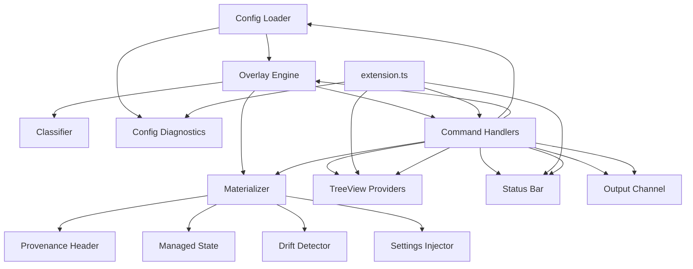

# SDD — Software Design Document

## Document Header

| Doc ID | Scope | Owner | Status |
|---|---|---|---|
| SDD-metaflow-ext | MetaFlow VS Code Extension | TBD | Draft |

| Last Updated | Related SRS | Related TCS | Notes |
|---|---|---|---|
| 2026-02-07 | SRS-metaflow-ext | TCS-metaflow-ext | Skeleton — populated incrementally per phase |

## Design Summary

- **Primary intent**: Implement the MetaFlow Reference Architecture as a pure TypeScript VS Code extension with deterministic overlay resolution, materialization with provenance, and profile/layer management UI.
- **Key constraints**: Pure TypeScript (no external-runtime CLI); strict mode; engine modules must not import `vscode`; deterministic output; JSONC tolerant config parsing.
- **Non-goals**: File-watcher auto-sync; git promotion automation; multi-root workspace support.

## Architecture Diagram

### Diagram Definitions

- **Config Loader (CL)**: Discovers and parses `.metaflow.json`; validates schema; returns typed config or error.
- **Config Diagnostics (CD)**: Maps parse/validation errors to VS Code diagnostic entries with line/column.
- **Overlay Engine (OE)**: Pure TS module; resolves layers, applies filters and profiles; produces `OverlayResult`.
- **Classifier (CLS)**: Determines `settings` vs `materialized` per artifact type and injection config.
- **Materializer (MAT)**: Writes classified files to `.github/`; manages provenance and state.
- **Provenance Header (PH)**: Generates and parses machine-readable provenance comments.
- **Managed State (MS)**: Persists file hashes for drift detection and safe re-render.
- **Drift Detector (DD)**: Compares current file hash against managed state to detect local edits.
- **Settings Injector (SI)**: Writes/removes VS Code settings for settings-backed artifact paths.
- **Command Handlers (CH)**: Maps `metaflow.*` commands to engine/materializer invocations.
- **TreeView Providers (TV)**: Renders profiles, layers, effective files, and config in sidebar.
- **Status Bar (SB)**: Displays active profile, file count, and sync state.
- **Output Channel (OC)**: Structured logging with timestamp and severity.

### Data Flow Narrative

- Config Loader reads `.metaflow.json`, validates it, and passes a typed config to the Overlay Engine.
- Overlay Engine resolves layers in precedence order, applies filters, activates the current profile, and produces an `OverlayResult` with classified effective files.
- Materializer consumes the `OverlayResult`: writes materialized files with provenance headers, updates managed state, injects settings for settings-classified files.
- Command Handlers orchestrate the flow and update UI components (TreeViews, Status Bar, Output Channel).
- On error, Config Diagnostics reports issues to the Problems panel; the extension degrades gracefully.

## Design Elements

| DES-ID | Name | Responsibility | Realizes REQ-ID(s) | Code Ref(s) |
|---|---|---|---|---|
| DES-0001 | Config Schema | TypeScript interfaces modelling `.metaflow.json` — single-repo, multi-repo, filters, profiles, injection, hooks | REQ-0001, REQ-0002, REQ-0003, REQ-0004 | `src/config/configSchema.ts` |
| DES-0002 | Config Path Utils | Discovers `.metaflow.json` at workspace root or `.ai/` fallback; resolves relative paths; boundary check | REQ-0001, REQ-0006 | `src/config/configPathUtils.ts` |
| DES-0003 | Config Loader | JSONC-tolerant parsing (`jsonc-parser`), schema validation, single/multi-repo mode detection | REQ-0001, REQ-0002, REQ-0003, REQ-0005 | `src/config/configLoader.ts` |
| DES-0004 | Config Diagnostics | Maps `ConfigError[]` to VS Code `Diagnostic` entries with line/column positioning | REQ-0007, REQ-0008 | `src/diagnostics/configDiagnostics.ts` |
| DES-0005 | Output Channel | Structured timestamped logging with configurable severity; auto-shows on error | REQ-0300 | `src/views/outputChannel.ts` |
| DES-0006 | Status Bar | Displays active profile, file count, sync state (idle/loading/error/drift) | REQ-0301, REQ-0302 | `src/views/statusBar.ts` |
| DES-0007 | Extension Entry | Activation, command registration, disposable management, settings listener | REQ-0400, REQ-0500 | `src/extension.ts` |
| DES-0100 | Engine Types | Pure TS interfaces: `LayerFile`, `LayerContent`, `EffectiveFile`, `OverlayResult`, `PendingChange` | REQ-0100, REQ-0101 | `src/engine/types.ts` |
| DES-0101 | Glob Matcher | Wraps `minimatch` with forward-slash normalization and dotfile support | REQ-0104, REQ-0105 | `src/engine/globMatcher.ts` |
| DES-0102 | Overlay Engine | Resolves single/multi-repo layers in precedence order; builds effective file map (later-wins) | REQ-0100, REQ-0101, REQ-0102, REQ-0103 | `src/engine/overlayEngine.ts` |
| DES-0103 | Filter Engine | Evaluates include/exclude glob patterns; exclude wins over include | REQ-0104, REQ-0105 | `src/engine/filterEngine.ts` |
| DES-0104 | Profile Engine | Applies active profile enable/disable patterns; disable wins over enable | REQ-0106, REQ-0107, REQ-0108 | `src/engine/profileEngine.ts` |
| DES-0105 | Classifier | Classifies artifacts as `settings` or `materialized` per directory prefix and injection overrides | REQ-0109, REQ-0110, REQ-0111, REQ-0112 | `src/engine/classifier.ts` |
| DES-0200 | Provenance Header | Generates/parses machine-readable HTML comment provenance blocks; round-trip guarantee | REQ-0200, REQ-0201, REQ-0202 | `src/engine/provenanceHeader.ts` |
| DES-0201 | Managed State | Load/save `.ai/.sync-state/overlay_managed.json`; SHA-256 content hashing | REQ-0203, REQ-0204, REQ-0205 | `src/engine/managedState.ts` |
| DES-0202 | Drift Detector | Compares current file hash vs managed state; classifies in-sync/drifted/missing/untracked | REQ-0206, REQ-0207 | `src/engine/driftDetector.ts` |
| DES-0203 | Materializer | Apply/clean/preview workflows; writes files with provenance; skip on drift; updates state | REQ-0200, REQ-0208, REQ-0209, REQ-0210, REQ-0211, REQ-0212 | `src/engine/materializer.ts` |
| DES-0204 | Settings Injector | Computes VS Code settings entries for settings-classified directories and hook paths; supports clean removal | REQ-0109, REQ-0110 | `src/engine/settingsInjector.ts` |
| DES-0300 | Command Handlers | Registers all 10 `metaflow.*` commands; manages ExtensionState with config, effectiveFiles, and change event; wires engine+materializer to VS Code UI | REQ-0300, REQ-0301, REQ-0302 | `src/commands/commandHandlers.ts` |
| DES-0301 | Init Config Command | Scaffolds `.metaflow.json` with sensible JSONC template; overwrite confirmation | REQ-0303 | `src/commands/initConfig.ts` |
| DES-0302 | Config TreeView | Displays metadata repo URL, commit, injection modes; refreshes on state change | REQ-0400 | `src/views/configTreeView.ts` |
| DES-0303 | Profiles TreeView | Lists profiles with check/circle icons for active state; click-to-switch | REQ-0401 | `src/views/profilesTreeView.ts` |
| DES-0304 | Layers TreeView | Shows layers in precedence order; single-repo and multi-repo modes; toggle-enabled commands | REQ-0402 | `src/views/layersTreeView.ts` |
| DES-0305 | Files TreeView | Groups effective files by classification (Settings / Materialized); shows source layer | REQ-0403 | `src/views/filesTreeView.ts` |
| DES-0306 | Extension Activation | Creates diagnostic collection, status bar, state, commands, TreeViews; auto-refresh; listens for settings changes | REQ-0001, REQ-0300 | `src/extension.ts` |
| DES-0307 | Status Bar (Phase 4) | State-driven display: idle/loading/error/drift; shows profile + file count; click-to-switch-profile | REQ-0500 | `src/views/statusBar.ts` |
| DES-0308 | Config Diagnostics (Phase 4) | Accepts external DiagnosticCollection; publishes from ConfigLoadResult | REQ-0501 | `src/diagnostics/configDiagnostics.ts` |

## Key Decisions

| Decision ID | Statement | Rationale | Status |
|---|---|---|---|
| DEC-0001 | Pure TypeScript engine (no external-runtime CLI) | Eliminates subprocess overhead and external runtime dependency. | Accepted |
| DEC-0002 | Engine modules must not import `vscode` | Enables fast unit testing without Extension Host. | Accepted |
| DEC-0003 | Use `jsonc-parser` for config files | Supports comments and trailing commas in `.metaflow.json`. | Accepted |
| DEC-0004 | Clean reference-architecture schema only | No legacy format support; simplifies validation. | Accepted |
| DEC-0005 | `_shared_` prefix for materialized files | Avoids name collisions; enables deterministic cleanup. | Accepted |
| DEC-0006 | SHA-256 content hashing for managed state | Reliable drift detection; widely supported. | Accepted |
| DEC-0007 | Detection-only promotion in v1 | Git automation deferred to reduce v1 scope and risk. | Accepted |

## Checklist

- Every `DES-*` row lists at least one `REQ-*` in `Realizes REQ-ID(s)`.
- Add `Code Ref(s)` for non-trivial design elements.

## Change Log

| Date | Change | Author |
|---|---|---|
| 2026-02-07 | Initial skeleton with architecture diagram and key decisions | AI |
| 2026-02-07 | Added DES-0001–DES-0007 (Phase 1: Config/UI scaffolding) and DES-0100–DES-0105 (Phase 2: Engine) | AI |
| 2026-02-07 | Added DES-0200–DES-0204 (Phase 3: Materialization) | AI |
| 2026-02-07 | Added DES-0300–DES-0308 (Phase 4: Extension UI + Commands) | AI |
